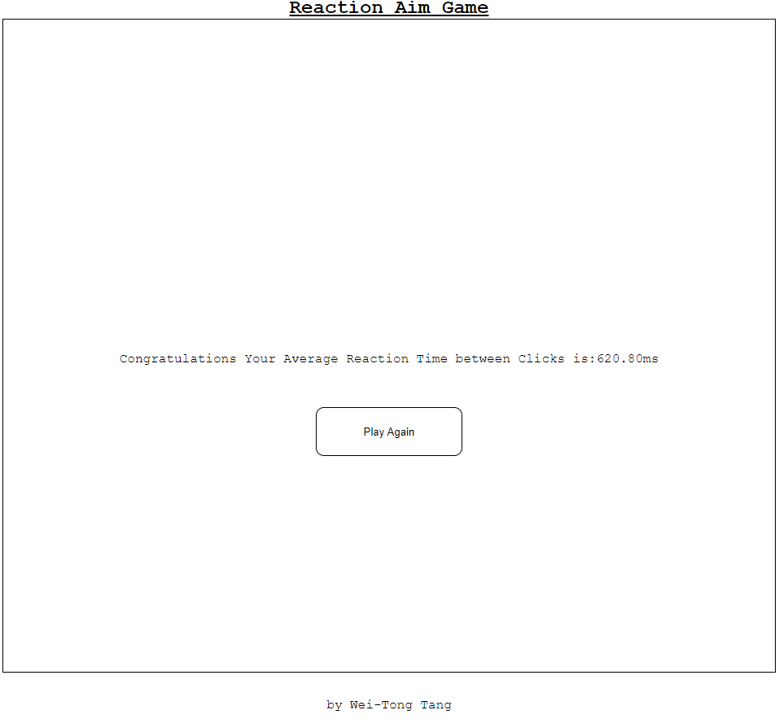

## Reaction Aim game
The reaction aim game is designed to test or refine a players ability to aim properly and snap onto the circles. It was based on CSGO aim trainers.

## General Info
The project was made during the JavaScript portion of the 12 Week _Nology course. As a formger Global Elite on CSGO I thought that creating a trainer would be fitting.

## How To Play
1. Click the blue circle start the game.
2. The red target will appear on screen and will randomly move after each click.
3. On completion the game will measure the time in between clicks on the red circle.
4. The Game willl returns after 15 clicks average time in between clicks.
5. Restart button appears.

## Langauges used
* HTML 5
* CSS 3
* JavaScript